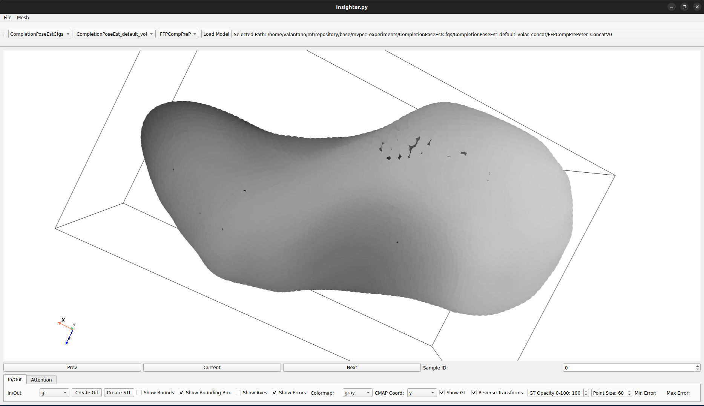
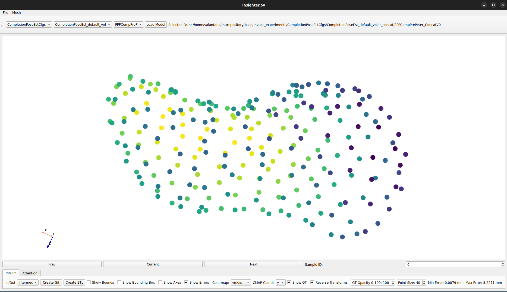
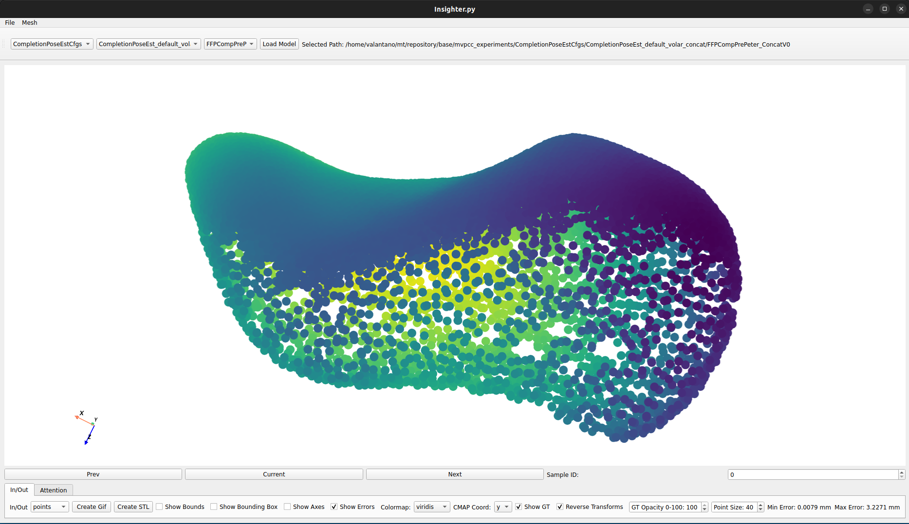
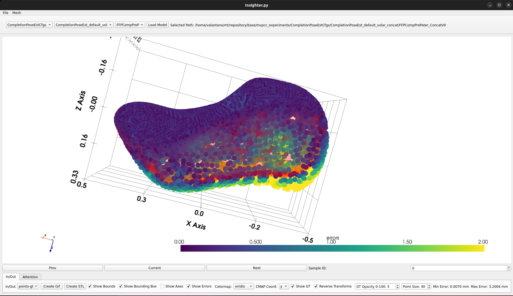

# Multi-View Bone Model Completion from Ultrasound Images

This repository is part of the master thesis of Valentino Geuenich at the RWTH Aachen University, and originates from a cooperation between the Chair of AI Methodology and the Chair of Medical Engineering.


| [AIM](https://aim.rwth-aachen.de/) | [mediTEC](https://www.meditec.hia.rwth-aachen.de/) |
|-----------------------------------|-------------------------------------------------|
|Chair of AI Methodology (Informatik 14) | Chair of Medical Engineering|
|Department of Computer Science | Faculty of Mechanical Engineering|
|RWTH Aachen University | RWTH Aachen University|

The thesis explored the challenge of multi-view bone model completion from ultrasound images, in
the specific use case of scaphoid shape reconstruction for surgical planning of percutaneous screw
fixation as treatment for scaphoid fractures. The use of ultrasound imaging techniques instead of
conventional computed tomography or magnetic resonance imaging for scaphoid reconstruction
presents several advantages, including reduced patient exposure to harmful ionizing radiation,
lower costs, and increased accessibility. Building on prior work that employed deep learning-
based point cloud completion methods for scaphoid reconstruction based on volar-side scans, this
thesis introduces a dorsal-side scan of the bone to enhance the completion accuracy, especially in
regions critical for surgical screw trajectory planning. However, due to challenges imposed by
the nature of ultrasound imaging techniques, the volar and dorsal scans are non-intersecting and
captured independently, resulting in two misaligned partial point clouds with zero overlap. To
incorporate both misaligned partials in the completion process, a state-of-the-art point cloud
 completion network is adapted in an exploratory fashion to incorporate mechanisms to either align
the partials or to process them in a pose-invariant manner. Two novel methods demonstrated
significant improvements over the baseline models on the validation set. In contrast, during the
evaluation on the test set, both methods exhibited significant performance drops in quantitative
metrics. Qualitative analysis suggests that the underlying generalization issue may be rooted in
the dataset, as both the proposed methods and the baselines exhibit similar failures. Despite these
limitations, the observed perceptual quality and reduced maximal point-wise distance errors suggest 
a more coherent reconstruction compared to the baselines, highlighting the potential of the
proposed methods in advancing ultrasound-based scaphoid reconstruction.


- CanonConcat: Pose-invariant reconstruction of the full point cloud. Loosing spatial relationship to the partial input point clouds. Modification of PointAttN architecture.
- CompletionPoseEst: Prior alignment of partial input point clouds based on pose estimation for each partial view, followed by completion. Modification of PointAttN architecture.
- PointAttNBaselineMin: Standard PointAttN baseline using only a single partial point cloud as input.
- AdaPoinTrBaselineMin: Standard AdaPoinTr baseline using only a single partial point cloud as input.


Visualization details:
- Red shadow indicates ground truth of the full point cloud.
- Viridis-heatmap visualizes point-wise reconstruction error, measured as the distance of each predicted point to its nearest neighbor in the ground truth.

<table width="100%" style="table-layout:fixed;">
    <colgroup>
        <col style="width:1%;">
        <col style="width:19%;">
        <col style="width:19%;">
        <col style="width:19%;">
        <col style="width:19%;">
        <col style="width:19%;">
    </colgroup>
    <tr>
        <th style="text-align:center;"></th>
        <th style="text-align:center;">Input&nbsp;Example&nbsp;&nbsp;&nbsp;&nbsp;&nbsp;&nbsp;</th>
        <th style="text-align:center;">CanonConcat&nbsp;&nbsp;&nbsp;&nbsp;&nbsp;&nbsp;&nbsp;&nbsp;</th>
        <th style="text-align:center;">CompletionPoseEst&nbsp;&nbsp;</th>
        <th style="text-align:center;">PointAttNBaselineMin</th>
        <th style="text-align:center;">AdaPoinTrBaselineMin</th>
    </tr>
    <tr>
        <td style="text-align:center; vertical-align:middle; writing-mode: vertical-lr; text-orientation: mixed;" width="5%">
            <strong>Sample 9</strong>
        </td>
        <td style="text-align:center; vertical-align:top;" width="19%">
            <br>
            <em>Input: Volar partial point cloud (blue) + Dorsal partial point cloud (green)</em>
        </td>
        <td style="text-align:center; vertical-align:top;" width="19%">
            <br>
            <em>Canon reconstruction.</em>
        </td>
        <td style="text-align:center; vertical-align:top;" width="19%">
            <br>
            <em>PointAttN with prior Pose Estimation using volar partial point cloud as anchor.</em>
        </td>
        <td style="text-align:center; vertical-align:top;" width="19%">
            <br>
            <em>PointAttN using volar partial point cloud.</em>
        </td>
        <td style="text-align:center; vertical-align:top;" width="19%">
            <br>
            <em>AdaPoinTr using volar partial point cloud.</em>
        </td>
    </tr>
    <tr>
        <td style="text-align:center; vertical-align:middle; writing-mode: vertical-lr; text-orientation: mixed;" width="1%">
            <strong>Sample 15</strong>
        </td>
        <td style="text-align:center; vertical-align:top;" width="19%">
            <br>
            <em>Input: Volar partial point cloud (blue) + Dorsal partial point cloud (green)</em>
        </td>
        <td style="text-align:center; vertical-align:top;" width="19%">
            <br>
            <em>Canon reconstruction.</em>
        </td>
        <td style="text-align:center; vertical-align:top;" width="19%">
            <br>
            <em>PointAttN with prior Pose Estimation using dorsal partial point cloud as anchor.</em>
        </td>
        <td style="text-align:center; vertical-align:top;" width="19%">
            <br>
            <em>PointAttN using dorsal partial point cloud.</em>
        </td>
        <td style="text-align:center; vertical-align:top;" width="19%">
            <br>
            <em>AdaPoinTr using dorsal partial point cloud.</em>
        </td>
    </tr>
</table>
Gifs Created with Insighter.py.


## Insighter.py
The repository comes with a visualization tool called `Insighter.py` that allows you to visualize the completion results as well as intermediate steps during the completion process. It is a GUI-based tool that allows you to select a model checkpoint and visualize the input and output of the model, as well as the attention weights of the model. The tool is implemented in PyQt5 and uses the.

### Example Visualizations from Insighter.py

<table width="100%" style="table-layout:fixed;">
    <colgroup>
        <col style="width:25%;">
        <col style="width:25%;">
        <col style="width:25%;">
        <col style="width:25%;">
    </colgroup>
    <tr>
        <th style="text-align:center;">Ground Truth</th>
        <th style="text-align:center;">Seeds</th>
        <th style="text-align:center;">Prediction</th>
        <th style="text-align:center;">Error Map</th>
    </tr>
    <tr>
        <td style="text-align:center;">
            
        </td>
        <td style="text-align:center;">
            
        </td>
        <td style="text-align:center;">
            
        </td>
        <td style="text-align:center;">
            
        </td>
    </tr>
    <tr>
</table>


# Structure

- `repository/archs` contains the concepts of the architectures used.
- `repository/base` contains the code base in order to implement the architectures (new code but also code from original papers that needed bigger adjustments).
    - `repository/base/cfg` contains config files for different architectures and runs/experiments.
    - `repository/base/mvpcc_experiments` contains logging and checkpoints for the experiments.
    - `repository/base/pretrained_weights` contains pretrained weights for PointAttN and AdaPoinTr.
    - `repository/base/scaphoid_datasets` contains different versions of the dataset classes, all inheriting from the `BaseDataset` class. Also containst the transformations that are applied to the dataset.
    - `repository/base/scaphoid_insight` implementation of a visualization tool for the completion results.
      <details>
      <summary>View details</summary>

      - `Insighter`: Main Class for the visualization tool. Uses `ConfigSelector` to select a model checkpoint. Uses `NetworkHandler` to process samples from the test(valid/train) set uisng the loaded checkpoint. Uses `InOutVisualizer` to visualize the final and intermediate completion results. Uses `AttnVisualizer` to visualize the attention weights of the model (depricated, might not work anymore).
      - `ConfigSelector`: Class to select a model checkpoint from the mvpcc_experiments folder.
      - `NetworkHandler`: Class to load the selected model and process samples from the dataset. 
      - `InOutVisualizer`: Class to visualize the input and output of the model, by accessing the `NetworkHandler`.
      - `AttnVisualizer`: Class to visualize the attention weights of the model. This is depricated and might not work anymore.
      - `AlignerDebugger`: Debugger Class to visualize intermediate steps during training. Used in the `runner` scripts.
      </details>
    - `repository/base/scaphoid_metrics` contains the implementation of weighted Chamfer Distance and F1 Score.
    - `repository/base/scaphoid_models` contains the implementation of the models used in the experiments.
      <details>
      <summary>View details</summary>

      - `ArchBuilder`: A class responsible for building the architecture of the model based on the configuration.
      - `ScaphoidModules`: Contains the modules that are used by `ArchBuilder` to build the model.
      - `ScaphoidAdaPoinTr`: Implementation of the AdaPoinTr model.
      - `ScaphoidPointAttN`: Implementation of different adaptations of the PointAttN model.
      - `PoseEstPointAttN`: Implementation of the PoseEstPointAttN (Pose Estimators) model and CompletionPoseEstPointAttN (Pose Estimators + PointAttN adaptations).
      </details>

    - `repository/base/scaphoid_unittests` contains some test cases for the metrics, rotations and AverageMeter.
    - `repository/base/scaphoid_utils` contains utility functions for the code base, like building the model, config loading, logging and checkpoint handling.
    - `repository/base/scripts` contains `.sh` files to start training manually or on the HPC cluster.
        <details>
            <summary>View details</summary>

            - `__*.sh` used by other scripts to run the corresponding python script.
            - `*.sh` define training parameters, like which adaptation to be trained forwarding them to the `__*.sh` which start the training either on the HPC or locally. 
            </details>
    - `main.py` starts the training of the `ScaphoidAdaPoinTr`, `ScaphoidPointAttN`, and `CompletionPoseEstPointAttN` models using the `runner_scaphoid.py` script.
    - `main_pose_est.py` starts the training of the PoseEstimators (`PoseEstPointAttN`) model using the `runner_pose_est.py` script.
    - `main_pose_est_both.py` starts the training of the `PoseEstPointAttN` model using the `runner_pose_est.py` script but with shared weights of the volar and dorsal pose estimators.
    - `smac3_pose_est.py` starts the HPO using either the `main.py` or `main_pose_est.py` or `main_pose_est_both.py` scripts. It uses the SMAC3 library to optimize the hyperparameters of the model.


- `repository/data` needs to be created by the user. It should contain a folder `ScaphoidDataset` containing all provided `.h5` files
- `repository/submodules` contains different repositories not as submodules but as subtrees. The reason for this is that the code needed to be modified in order to work with the current codebase. Hence, the code is not the original code from the repository but a modified version of it. The original repository is linked in the README.md of the respective subdirectory.


# Set Up

## Create Module Environment on HPC (with new Rocky Linux 9)

Simply follow below steps. 

1. Load Base Module on HPC
    ```
    module load GCC/13.3.0  OpenMPI/5.0.3 CUDA/12.6.3
    pip install torch==2.6.0 torchvision==0.21.0 torchaudio==2.6.0 --index-url https://download.pytorch.org/whl/cu126
    pip install --upgrade --force-reinstall setuptools
    pip install --user --upgrade setuptools packaging

    export CC=gcc
    export CXX=g++
    ```


2. Build PointAttN and PoinTr extensions
    ```
    cd ~/multi-view-point-cloud-completion/submodules/PointAttn/utils/mm3d_pn2
    python setup.py build_ext --inplace

    cd ~/multi-view-point-cloud-completion/submodules/PointAttn/utils/ChamferDistancePytorch/chamfer3D
    python setup.py install --user
    pip install --user .
    ```

    ```
    cd ~/multi-view-point-cloud-completion/submodules/PoinTr/extensions/chamfer_dist
    python setup.py install --user
    pip install --user .
    cd ~/multi-view-point-cloud-completion/submodules/PoinTr/extensions/gridding
    python setup.py install --user
    pip install --user .
    cd ~/multi-view-point-cloud-completion/submodules/PoinTr/extensions/cubic_feature_sampling
    python setup.py install --user
    pip install --user .
    cd ~/multi-view-point-cloud-completion/submodules/PoinTr/extensions/emd
    python setup.py install --user
    pip install --user .
    cd ~/multi-view-point-cloud-completion/submodules/PoinTr/extensions/gridding_loss
    python setup.py install --user
    pip install --user .
    ```

3. Install PointAttN and PoinTr and do hotfix for PoinTr. The hotfix is needed because without the pip install the internal imports from PoinTr will not work (e.g. inside PoinTr.utils.logger import utils)
    ```
    cd ~/multi-view-point-cloud-completion/submodules
    pip install -e .
    cd ~/multi-view-point-cloud-completion/submodules/PoinTr
    pip install -e .
    ```


4. Install pointnet2_pytorch (cloned into submodules and commented out ARCHLIST):
    ```
    export TMPDIR=$HOME/tmp
    mkdir -p $TMPDIR

    cd ~/multi-view-point-cloud-completion/submodules/Pointnet2_PyTorch/pointnet2_ops_lib
    python setup.py install --user
    cd ~/multi-view-point-cloud-completion/submodules/Pointnet2_PyTorch/
    pip install -r requirements.txt
    ```

5. Install all requirements using pip. Be carefull, pip is bad in managing dependencies. If you get an error, try to install the package manually.
   Some packages might take half an hour to install (mmcv-full). 
    ```
    cd ~/multi-view-point-cloud-completion/
    pip install -r requirements.txt
    pip install --upgrade --user numpy
    ```

    If there are issues try:
    ```
    pip install torchvision==0.21.0 torchaudio==2.6.0 --index-url https://download.pytorch.org/whl/cu126
    ```

6. Install SMAC3
    ```
    conda install gxx_linux-64 gcc_linux-64 swig
    pip install smac
    pip install --user smac
    ```

7. Save Module Configuration
    ```
    module save mt9
    ```


## Local install using conda
1. Create a new conda environment and install base packages:
    ```
    conda create -n scaphoid python=3.11.3
    conda activate scaphoid
    ```

    ```
    conda install pytorch==2.1.2 torchvision==0.16.2 torchaudio==2.1.2 pytorch-cuda=12.1 -c pytorch -c nvidia
    pip install numpy==1.25.1
    ```

2. Install PointAttN and PoinTr extensions:
    ```
    cd ~/mt/repository/submodules/PointAttn/utils/mm3d_pn2
    python setup.py build_ext --inplace
    ```

    ```
    cd ~/mt/repository/submodules/PoinTr/extensions/chamfer_dist
    python setup.py install --user
    cd ~/mt/repository/submodules/PoinTr/extensions/gridding
    python setup.py install --user
    cd ~/mt/repository/submodules/PoinTr/extensions/cubic_feature_sampling
    python setup.py install --user
    cd ~/mt/repository/submodules/PoinTr/extensions/emd
    python setup.py install --user
    cd ~/mt/repository/submodules/PoinTr/extensions/gridding_loss
    python setup.py install --user
    ```

3. Install PointAttN and PoinTr and do hotfix for PoinTr. The hotfix is needed because without the pip install the internal imports from PoinTr will not work (e.g. inside PoinTr.utils.logger import utils)
    ```
    cd ~/mt/repository/submodules/PointAttn/utils/ChamferDistancePytorch/chamfer3D
    python setup.py install --user
    pip install --user .
    ```

    ```
    cd ~/mt/repository/submodules
    pip install -e .
    cd ~/mt/repository/submodules/PoinTr
    pip install -e .
    ```

4. Install pointnet2_pytorch (cloned into submodules and commented out ARCHLIST):
    ```
    cd ~/mt/repository/submodules/Pointnet2_PyTorch/pointnet2_ops_lib
    python setup.py install --user
    ```

5. Install all requirements using pip. Be carefull, pip is bad in managing dependencies. If you get an error, try to install the package manually.
   Some packages might take half an hour to install (mmcv-full). 
    ```
    cd ~/mt/repository/
    pip install -r requirements.txt
    ```

    ```
    pip install PyQt5 PyQtWebEngine
    pip install orange3==3.23.1
    ```

6. Install SMAC3
    ```
    conda install gxx_linux-64 gcc_linux-64 swig
    pip install smac
    pip install --user smac
    ```